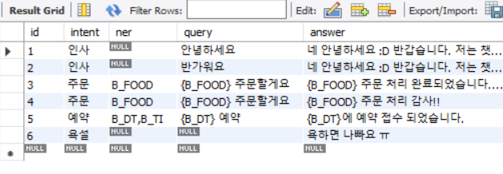

# 챗봇 프로젝트

자연어 처리를 공부하기 위해 딥러닝 챗봇을 구현

처음 배우는 딥러닝 챗봇이라는 책을 구매하진 않고 블로그를 보고 구현하면서 고도화 예정

빠르게 완성하고 개선해나가는 방향

---

### 1일차

2022-02-03

- mysql 사용자 만들고 데이터베이스 생성
- 학습 데이터를 엑셀을 이용해 구현하여 제공하는 엑셀 파일을 구해 데이터베이스와 동기화
- mysql과 workbench연동

---
### 2일차

2022-02-03

- 자연어 처리를 위해 KoNLPy 설치후 Komoran 사용
- 모듈 설치에 따란 오류  해결
- Preprocess  클래스 블로그 따라 일부 작성
- 3일차에 코드 분석 예정
