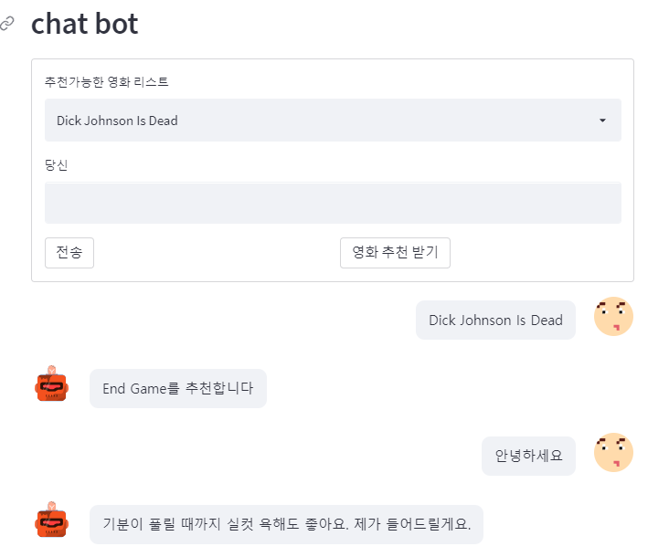

# chat bot 
python version. 3. 9

### app version
- 1.0.0

### env
- window
- colab (for training algorithms)

### tool
- pycharm

### dataset
- used the Wellness Conversation provided by the AI hub
- used Netflix_data by Kaggle

### Strategies
- cosine similarity

### api
- streamlit(A faster way to build and share data apps)

### app start
- streamlit run

### reviews by version
#### at version 1.0.0
1. It is difficult to derive an appropriate utterance using only the similarity due to the lack of a dataset.

#### Update content
- Netflix movie recommendations

#### to be updated
- sharing using streamlit cloud